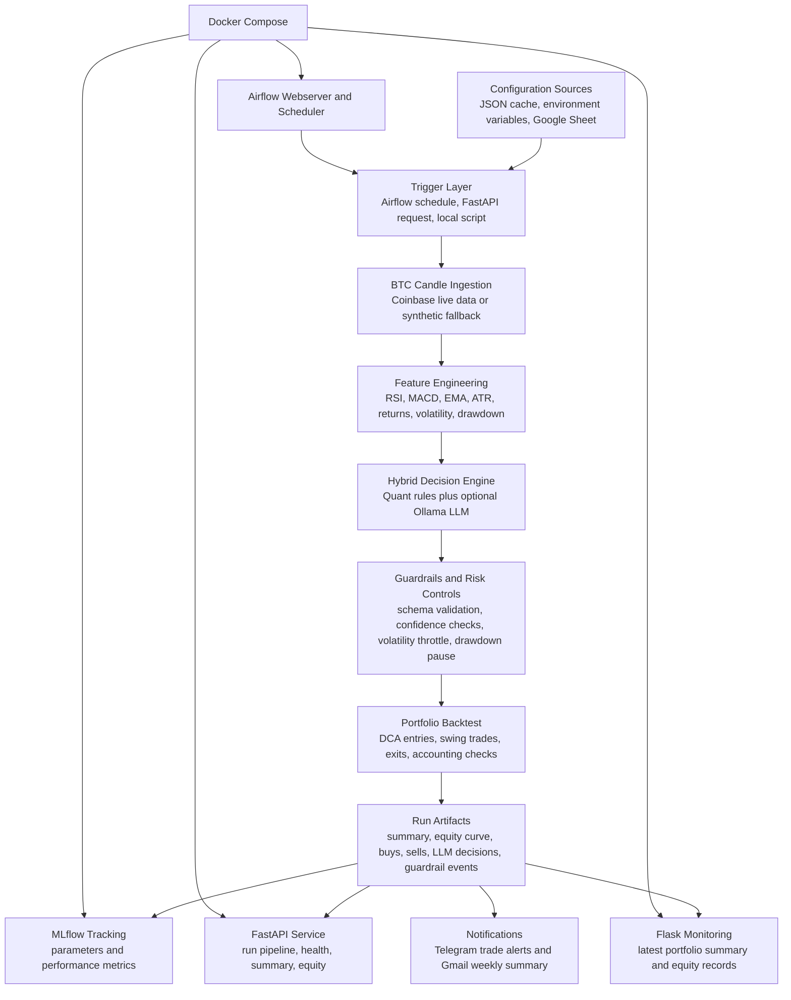
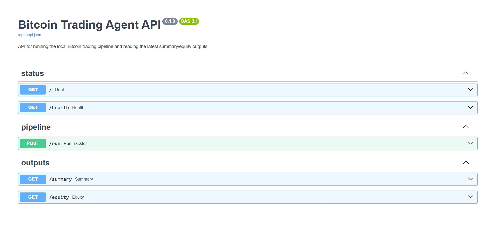
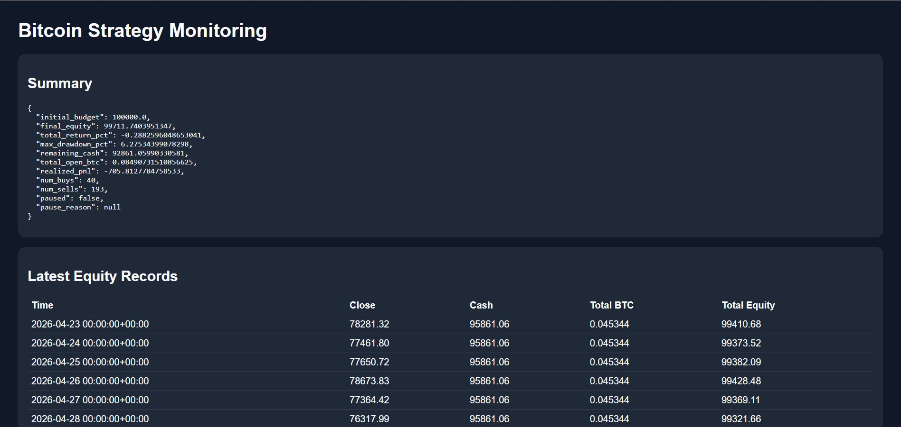
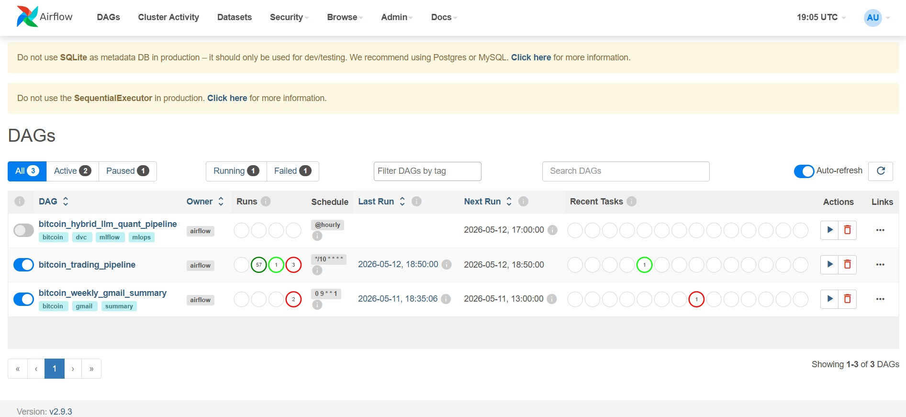
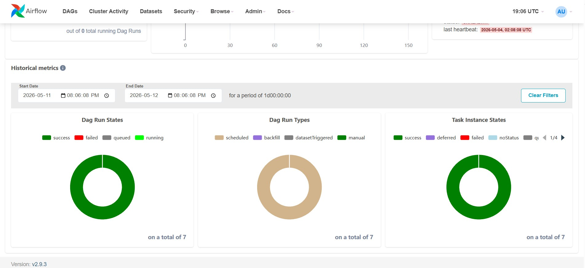
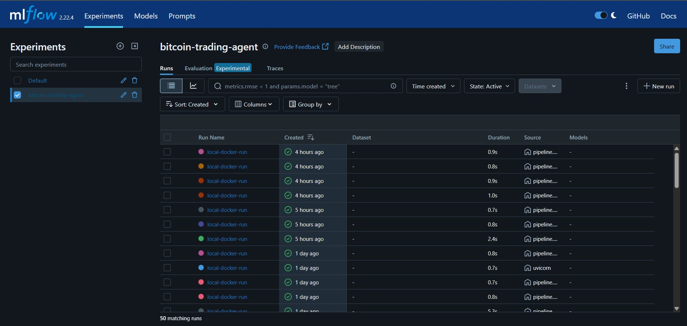
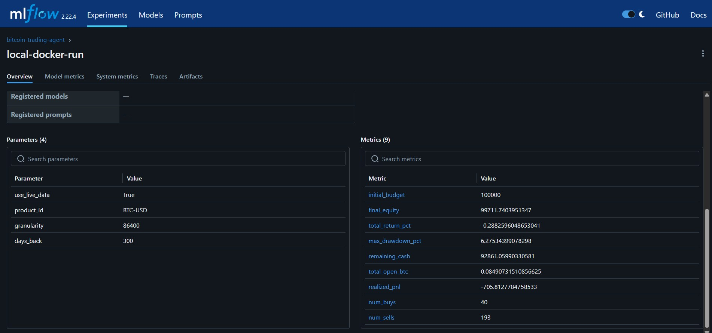

# Bitcoin Trading Agent

Hybrid LLM and quantitative Bitcoin trading pipeline with reproducible backtesting, risk guardrails, MLflow experiment tracking, FastAPI serving, Flask monitoring, Airflow orchestration, and notification automation.

This project demonstrates an end-to-end MLOps-style workflow for a trading research system: market data is collected, transformed into technical indicators, evaluated by a conservative strategy engine, logged for experiment tracking, exposed through APIs and dashboards, and scheduled through Airflow. The implementation is designed to be locally runnable with synthetic fallback data while still supporting live BTC-USD candles, Google Sheet configuration, Telegram alerts, and Gmail weekly summaries.

> This repository is for educational and portfolio purposes. It is not financial advice and should not be used as a live trading system without additional validation, controls, and compliance review.

## Project Highlights

- **Hybrid decision engine:** combines quantitative indicators with an optional local Ollama LLM decision layer.
- **Risk-first strategy design:** validates LLM output with schema normalization, feature whitelisting, confidence thresholds, volatility throttling, drawdown pauses, trade cooldowns, and indicator confirmation.
- **Reproducible pipeline:** separates data ingestion, feature engineering, backtesting, output generation, and experiment logging.
- **Production-style services:** Docker Compose runs MLflow, FastAPI, Flask monitoring, Airflow webserver, and Airflow scheduler.
- **Monitoring and reporting:** produces equity curves, trade logs, LLM decisions, guardrail events, summaries, and notification-ready reports.
- **Automation-ready:** supports Airflow scheduling, Google Sheet config refresh, Telegram trade alerts, and Gmail weekly reporting.
- **Test coverage:** includes unit tests for configuration, features, notifications, accounting checks, and strategy guardrails.

## Architecture



## Step-by-Step Project Flow

### 1. Configuration Management

Runtime parameters are loaded from `config/default_config.json`, `config/config_cache.json`, environment variables, or a Google Sheet. This makes the strategy configurable without editing source code.

Key configurable items include:

- BTC product and candle granularity
- Lookback window
- Starting portfolio budget
- DCA and swing-trading allocations
- ATR, RSI, MACD, and EMA thresholds
- LLM usage and Ollama settings
- Drawdown pause and volatility throttling limits
- Notification credentials

### 2. Data Ingestion

The pipeline fetches BTC-USD OHLCV candles from the Coinbase Exchange public API when live data is enabled. If live data is unavailable, the system can fall back to synthetic demo candles so the project remains runnable in local and Docker environments.

Primary function:

```text
trading_pipeline.pipeline.fetch_data()
```

Outputs:

```text
data/raw/btc_candles.csv
outputs/candles.csv
```

### 3. Feature Engineering

Raw candle data is transformed into a feature table used by the strategy engine. The feature layer calculates technical indicators and market-state signals including:

- Average True Range
- RSI
- SMA and EMA windows
- MACD, signal, and histogram
- 1-day, 3-day, and 7-day returns
- 14-day volatility
- ATR percent
- Volume z-score
- Distance from moving averages
- Drawdown from rolling peak
- Momentum score

Primary function:

```text
trading_pipeline.strategy_core.prepare_feature_table()
```

Outputs:

```text
data/processed/features.csv
outputs/features.csv
```

### 4. Hybrid Strategy Decisioning

The strategy supports two decision modes:

- **Deterministic fallback:** uses RSI, MACD, EMA trend, ATR, and drawdown logic.
- **Optional LLM mode:** calls a local Ollama model and requests structured JSON with regime, signal, confidence, selected features, risk multiplier, and reason.

Supported trading regimes:

- `value_investing`
- `swing_trading`
- `hold`

Supported signals:

- `buy`
- `sell`
- `hold`

The LLM is intentionally optional. With `use_llm=false`, the system remains deterministic and testable.

### 5. Guardrails and Risk Controls

Before any decision affects the portfolio, the project applies safety checks that make the decision layer auditable and conservative.

Implemented controls include:

- JSON schema normalization
- Allowed-feature whitelist
- Confidence threshold for trades
- Risk multiplier clipping
- High-volatility risk reduction
- Soft drawdown throttling
- Hard drawdown pause
- Regime persistence checks
- Indicator confirmation
- Minimum candles between trades
- Position-level stop loss and take profit for swing trades

These controls are especially important because LLM output can be inconsistent. The project treats the LLM as an advisory layer, not as an unrestricted trading authority.

### 6. Backtesting and Outputs

The backtest simulates portfolio activity, tracks open positions, records buys and sells, and calculates summary performance.

Generated outputs include:

```text
outputs/summary.json
outputs/equity_curve.csv
outputs/buys.csv
outputs/sells.csv
outputs/llm_decisions.csv
outputs/guardrail_events.csv
reports/latest_run/summary.json
reports/latest_run/equity_curve.csv
```

Important summary metrics:

- Initial budget
- Final equity
- Total return percentage
- Maximum drawdown
- Remaining cash
- Open BTC
- Realized PnL
- Number of buys and sells
- Portfolio pause status

### 7. MLflow Experiment Tracking

Each pipeline run can log parameters and metrics to MLflow. This makes it easier to compare strategy settings, review performance, and demonstrate experiment-management discipline.

Tracked examples:

- `use_live_data`
- `product_id`
- `granularity`
- `days_back`
- Final equity
- Total return
- Max drawdown
- Realized PnL

### 8. API and Monitoring Layer

FastAPI exposes the pipeline and latest results through simple endpoints:

```text
GET  /
GET  /health
POST /run?use_live_data=false
GET  /summary
GET  /equity
```

Flask provides a lightweight dashboard for reviewing the latest summary and equity records.

### 9. Orchestration with Airflow

The Airflow DAG schedules the project workflow:

```text
refresh_config_task
fetch_data_task
build_features_task
backtest_task
```

The main DAG is scheduled hourly and is designed around a production-like separation of responsibilities. A second weekly summary DAG can send Gmail performance reports every Monday morning.

### 10. Notifications

The project includes notification utilities for:

- Telegram trade alerts for new buy and sell events
- De-duplication of already-sent trade alerts
- Gmail weekly summary emails with portfolio performance metrics

Credentials are loaded from `.env` and are intentionally excluded from version control.

## Dashboard Examples

### FastAPI

The FastAPI Swagger UI documents the available service endpoints and allows manual pipeline execution from the browser.



### Flask Monitoring

The Flask dashboard displays the latest portfolio summary and recent equity records from generated outputs.



### Airflow

Airflow orchestrates the trading workflow, making each pipeline stage visible, schedulable, and inspectable.





### MLflow

MLflow tracks strategy runs, parameters, and metrics for experiment comparison and reproducibility.





## Repository Structure

```text
.
|-- api/                      FastAPI service
|-- airflow/                  Airflow local metadata/config
|-- config/                   Default and cached runtime configuration
|-- dags/                     Airflow DAG definitions
|-- data/                     Raw and processed datasets
|-- images/                   README dashboard screenshots
|-- mlflow/                   MLflow backend and artifacts volume
|-- monitoring/               Flask monitoring dashboard
|-- notebooks/                Research notebooks and experiments
|-- reports/                  Latest report artifacts
|-- requirements/             Service-specific dependency files
|-- scripts/                  Utility scripts
|-- src/trading_pipeline/     Core package: pipeline, strategy, config, notifications
|-- tests/                    Unit tests
|-- docker-compose.yml        Multi-service local stack
|-- Dockerfile*               Service Dockerfiles
|-- pyproject.toml            Package metadata and pytest config
```

## Quick Start

### 1. Clone the Repository

```bash
git clone <repository-url>
cd <repository-folder>
```

### 2. Create a Local Environment

```bash
python -m venv .venv
```

Windows PowerShell:

```powershell
.\.venv\Scripts\Activate.ps1
```

macOS/Linux:

```bash
source .venv/bin/activate
```

### 3. Install Dependencies

```bash
pip install -r requirements.txt
pip install -r requirements/dev.txt
```

### 4. Configure Environment Variables

Copy the example environment file and fill in only the integrations you plan to use:

```bash
cp .env.example .env
```

For Windows PowerShell:

```powershell
Copy-Item .env.example .env
```

Optional integrations:

- Google Sheets config refresh
- Telegram trade alerts
- Gmail weekly summaries
- Local Ollama model for LLM-assisted decisions

### 5. Run the Pipeline Locally

```bash
python -m trading_pipeline.pipeline
```

To run a deterministic local demo through Docker or API, use `use_live_data=false`.

### 6. Run Tests

```bash
pytest
```

## Docker Compose Workflow

Start the full local stack:

```bash
docker compose up --build
```

Open the services:

| Service | URL | Purpose |
| --- | --- | --- |
| FastAPI | http://localhost:8000/docs | API docs and manual pipeline trigger |
| MLflow | http://localhost:5000 | Experiment tracking |
| Flask Monitoring | http://localhost:8050 | Latest strategy output dashboard |
| Airflow | http://localhost:8080 | Pipeline orchestration |

Default Airflow credentials:

```text
Username: admin
Password: admin
```

Run a fresh pipeline execution from Docker:

```bash
docker compose run --rm app python -m trading_pipeline.pipeline
```

Trigger a pipeline execution through FastAPI:

```bash
curl -X POST "http://localhost:8000/run?use_live_data=false"
```

PowerShell:

```powershell
Invoke-RestMethod -Method Post -Uri "http://localhost:8000/run?use_live_data=false"
```

## Key Technical Contributions

This project showcases several practical engineering contributions that hiring managers and recruiters can evaluate clearly:

- Built a modular Python package for a BTC trading research workflow.
- Designed a hybrid LLM and quantitative strategy engine with deterministic fallback behavior.
- Implemented safety guardrails that constrain LLM output before it can affect portfolio simulation.
- Created a reproducible backtesting flow with generated artifacts for equity, trades, decisions, guardrails, and performance summaries.
- Added MLflow tracking so experiments can be compared across parameters and runs.
- Exposed the system through a FastAPI service with health, run, summary, and equity endpoints.
- Built a Flask monitoring dashboard for quick inspection of the latest run.
- Orchestrated the workflow with Airflow DAGs for scheduled config refresh, data ingestion, feature generation, and backtesting.
- Added Telegram and Gmail notification paths for operational reporting.
- Containerized the stack with Docker Compose across API, monitoring, MLflow, and Airflow services.
- Wrote focused unit tests for strategy accounting, guardrails, features, configuration, and notifications.

## What This Demonstrates

From a machine-learning engineering perspective, this project demonstrates the ability to move beyond notebook experimentation into a structured, inspectable system. It connects model-assisted decisioning, risk management, experiment tracking, API serving, orchestration, testing, and monitoring in one cohesive workflow.

From a software engineering perspective, it shows attention to modularity, environment configuration, reproducibility, service boundaries, Docker-based deployment, and practical failure handling.

From a business and product perspective, it presents a trading research system in a way that stakeholders can inspect: the API shows available actions, the dashboards show outputs, MLflow shows experiment history, and Airflow shows operational flow.

## Future Improvements

- Add richer performance analytics such as Sharpe ratio, Sortino ratio, win rate, exposure, and benchmark comparison.
- Add a persistent database for run history and dashboard queries.
- Add authentication for deployed API and dashboard access.
- Expand MLflow logging with artifacts, plots, and model/config versions.
- Add CI workflows for test automation and linting.
- Add broker-paper-trading integration behind strict safety controls.
- Improve the monitoring UI with charts, filters, and run selection.

## Conclusion

This repository represents my contribution to building a practical end-to-end Bitcoin trading research platform: not only a strategy notebook, but a working system with APIs, dashboards, orchestration, experiment tracking, notifications, Docker services, tests, and risk controls.

For hiring managers and recruiters, the most important takeaway is that this project demonstrates hands-on ownership across the full lifecycle of an applied ML/analytics product. I translated a trading idea into a maintainable engineering workflow, made it observable through dashboards and MLflow, made it operable through Airflow and Docker, and added guardrails so the decision process remains transparent and controlled.
